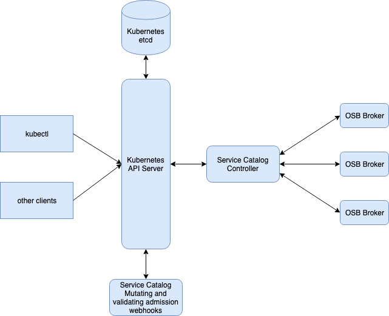

# Design of the Service Catalog

Table of Contents
- [Overview](#overview)
- [Terminology](#terminology)
- [Open Service Broker API](#open-service-broker-api)
- [Service Catalog Design](#service-catalog-design)
- [Current Design](#current-design)

## Overview

The Service Catalog is an implementation of the
[Open Service Broker API](https://github.com/openservicebrokerapi) for
Kubernetes. It allows for:
- a Service Broker to register with Kubernetes
- a Service Broker to specify the set of Services (and variantions of those
  Services) to Kubernetes that should then be made available to Kubernetes'
  users
- a user of Kubernetes to discover the Services that are available for use
- a user of Kubernetes to request for a new ServiceInstance of a Service
- a user of Kubernetes to link an ServiceInstance of a Service to a set of Pods

This infrastructure allows for a loose-coupling between Applications
running in Kubernetes and the Services they use.
The Service Broker, in its most basic form, is a blackbox entity. Whether
it is running within Kubernetes itself is not relevant. This allows for
the Application that uses those Services to focus on its own business logic
while leaving the management of these Services to the entity that owns
them.

## Terminology

- **Application** : Kubernetes uses the term "service" in a different way
  than Service Catalog does, so to avoid confusion the term *Application*
  will refer to the Kubernetes deployment artifact that will use a Service
  Instance.
- **ServiceBinding**, or *Service Binding* : a link between a Service Instance
  and an Application. It expresses the intent for an Application to
  reference and use a particular Service Instance.
- **ServiceBroker**, or *Service Broker* : a entity, available via a web endpoint,
  that manages a set of one or more Services.
- **Credentials** : Information needed by an Application to talk with a
  Service Instance.
- **ServiceInstance**, or *Service Instance* : Each independent use of a Service
  Class is called a Service Instance.
- **Service Class**, or *Service* : one type of Service that a Service Broker
  offers.
- **Plan**, or *Service Plan* : one type of variant of a Service Class. For
  example, a Service Class may expose a set of Plans that offer
  varying degrees of quality-of-services (QoS), each with a different
  cost associated with it.

## Open Service Broker API

The Service Catalog is a compliant implementation of the
[Open Service Broker API](https://github.com/openservicebrokerapi/servicebroker/blob/master/spec.md) (OSB API). The OSB API specification is the evolution of
the [Cloud Foundry Service Broker API](https://docs.cloudfoundry.org/services/api.html).

This document will not go into specifics of how the OSB API works, so for
more information please see:
[Open Service Broker API](https://github.com/openservicebrokerapi/servicebroker).
The rest of this document assumes that the reader is familiar with the
basic concepts of the OSB API specification.

## Service Catalog Design

The following diagram represents the design of the Service Catalog:

Note that the current state of the project does not full support everything
as described in this design yet, but it is useful to start with our goals
and then point out the places (via a **[DIFF]** marker) where our current
state of the project differs.

At the core of the Service Catalog, as with the Kubernetes core, is an
API Server and a Controller. The API Server is an HTTP(s) RESTful front-end for
a storage component. Users of the system, as well as other components of
the system, interact with the API server to perform CRUD type of operations
on the Service Catalog's resource model. As with Kubernetes itself, the
`kubectl` command line tool can be used to interact with the Service Catalog
resource model.

The storage component behind the Service Catalog's API Server can either be
[etcd](https://github.com/coreos/etcd) or
[Custom Resources](https://kubernetes.io/docs/concepts/api-extension/custom-resources/) (CRDs).
The `rest.storage` interface abstracts the specific persistent storage
facility being used.
When etcd is used, the instance(s) of etcd will be distinct from the etcd
instances of the Kubernetes core - meaning, the Service Catalog will have its
own persistent storage that is separate from the Kubernetes core.
When CRDs are used, those resources will be stored in the Kubernetes core
and therefore a separate persistent storage (from Kubernetes) is not needed.

**[DIFF]** *As of now the API Server can only use etcd as its persistent
storage. The plan is to add support for CRDs to the `rest.storage` interface
of the API Server in the near future.*

The Service Catalog API resources are defined within a file called
`pkg/apis/servicecatalog/types.go` and the version
of the api is in `pkg/apis/servicecatalog/v1beta1/`.

The controller implements the behaviors of the service-catalog API. It monitors the
API resources (by watching the API server), and takes the appropriate
actions based on the user's desired intent.

To understand the Service Catalog resource model, it is best to walk through
a typical workflow:

### Registering a Service Broker

**TODO** Talk about namespaces - ServiceBrokers, ServiceClasses are not in a ns.
But ServiceInstances, ServiceBindings, Secrets and ConfigMaps are. However, instances
can be in different NS's than the rest (which must all be in the same).

Before a Service can be used by an Application it must first be registered
with the Kubernetes platform. Since Services are managed by Service Brokers
we must first register the Service Broker by creating an instance of a
`ClusterServiceBroker`:

    kubectl create -f broker.yaml

where `broker.yaml` might look like:

    apiVersion: servicecatalog.k8s.io/v1beta1
    kind: ClusterServiceBroker
    metadata:
      name: best-db-broker
    spec:
      url: http://bestdatabase.com

**Note:** As the name implies, the `ClusterServiceBroker` resource is cluster-scoped, ie,
outside of any namespace.

**TODO** beef-up these sample resource snippets

After a `ClusterServiceBroker` resource is created the Service Catalog Controller will
receive an event indicating its addition to the datastore. The Controller
will then query the Service Broker (at the `url` specified) for the list
of available Services. Each Service will then have a corresponding
`ClusterServiceClass` resource created:

    apiVersion: servicecatalog.k8s.io/v1beta1
    kind: ClusterServiceClass
    metadata:
      name: smallDB
    spec:
      bindable: true
      clusterServiceBrokerName: ups-broker
      description: A user provided service
      externalID: 4f6e6cf6-ffdd-425f-a2c7-3c9258ad2468
      externalName: user-provided-service
      planUpdatable: false

Each Service has one or more Plans associated with it.

For each plan of each service, a `ClusterServicePlan` will be created.

**TODO** Anything special about the CF flows we need to discuss?

Users can then query for the list of available Services:

    kubectl get clusterserviceclasses

### Creating a Service Instance

Before a Service can be used, a new ServiceInstance of it must be created. This is
done by creating a new `ServiceInstance` resource:

    kubectl create -f instance.yaml

where `instance.yaml` might look like:

    apiVersion: servicecatalog.k8s.io/v1beta1
    kind: ServiceInstance
    metadata:
      namespace: example-ns
      name: test-database
    spec:
        clusterServiceClassExternalName: small-db
        clusterServicePlanExternalName: free

Within the `ServiceInstance` resource is the specified Plan to be used. This allows
for the user of the Service to indicate which variant of the Service they
want - perhaps based on QoS type of variants.

When creating a `ServiceInstance`, extra metadata (called "parameters") can be
passed in to help configure the new Service being provisioned. Parameters
can be provided two different ways: raw JSON or referencing a Kubernetes
Secret. In the case of a Secret, the Secret name and key holding the
parameters must be provided.
The value of the key must be JSON that is then
merged with any other parameters specified. It is an error for two
sets of parameters to include the same top-level JSON property name.

When referencing a Secret it is important to note that any updates made to
the Secret will not automatically cause the Service Catalog to send an
update request to the Service Broker for the Service Instance. In other words,
the Service Catalog is not watching for Secret changes. In order to force an
update to occur you must manually change something within the
ServiceInstanceSpec resource that would cause a reconciliation to occur.
Within the ServiceInstanceSpec is a property called `UpdateRequests` which
can be incremented to cause this to happen.

For more information, see the documentation on [parameters](parameters.md).

**TODO** Discuss the parameters that can be passed in

Once an `ServiceInstance` resource is created, the Controller talks with the
specified Service Broker to create a new ServiceInstance of the desired Service.

There are two modes for provisioning:
[synchronous and asynchronous](https://github.com/openservicebrokerapi/servicebroker/blob/master/spec.md#synchronous-and-asynchronous-operations)

For synchronous operations, a request is made to the Service Broker and upon
successful completion of the request (200 OK), Service Instance can now be used by
Application.

Some brokers support
[asynchronous](https://github.com/openservicebrokerapi/servicebroker/blob/master/spec.md#asynchronous-operations)
flows. When a Controller makes a request to Service Broker to
create/update/deprovision a Service Instance, the Service Broker responds with
202 ACCEPTED, and will provide endpoint at
GET /v2/service_instances/<service_instance_id>/last_operation
where the Controller can poll the status of the request.

Service Broker may return a last_operation field that then should be sent
for each last_operation request. Controller will poll while the state of
the poll request is 'in_progress'. Controller can also implement a max
timeout that it will poll before considering the provision failed and will
stop polling and mark the provisioning as failed.

While a Service Instance has an asynchronous operation in progress, controller
must ensure that there no other operations (provision,deprovision,update,bind,unbind).

**TODO** test to see if we have checks to block people from using an ServiceInstance
before its fully realized. We shouldn't let the SB be the one to detect this.

### Using a Service Instance

Before a Service Instance can be used it must be "bound" to an Application.
This means that a link, or usage intent, between an Application and the
Service Instance must be established. This is done by creating a new
`ServiceBinding` resource:

    kubectl create -f binding.yaml

where `instance.yaml` might look like:

    apiVersion: servicecatalog.k8s.io/v1beta1
    kind: ServiceBinding
    metadata:
      namespace: example-ns
      name: test-database-binding
    spec:
      instanceRef:
        name: test-database
      secretName: db-secret

The Controller, upon being notified of the new `ServiceBinding` resource, will
then talk to the Service Broker to create a new ServiceBinding for the specified
Service Instance.

Within the ServiceBinding object that is returned from the Service Broker are
a set of Credentials. These Credentials contain all of the information
needed for the application to talk with the Service Instance. For example,
it might include things such as:
- coordinates (URL) of the Service Instance
- user-id and password to access the Service Instance

The OSB API specification does not mandate what properties might appear
in the Credentials, so the Application is required to understand the
specified data returned and how to use it properly. This is typically done
by reading the documentation of the Service.

The Credentials will not be stored in the Service Catalog's datastore.
Rather, they will be stored in the Kubenetes core as Secrets and a reference
to the Secret will be saved within the `ServiceBinding` resource. If the
ServiceBinding `spec.secretName` is not specified then the Controller will
use the ServiceBinding `metadata.name` property as the name of the Secret.

ServiceBindings are not required to be in the same Kubenetes Namespace
as the Service Instance. This allows for sharing of Service Instances
across Applications and Namespaces.

Once the Secret is made available to the Application's Pods, it is then up
to the Application code to use that information to talk to the Service
ServiceInstance.

### Deleting Service Instances

As with all resources in Kubernetes, you can delete any of the Service
Catalog resource by doing an HTTP DELETE to the resource's URL. However,
it is important to note the you can not delete a Service Instance while
there are ServiceBindings associated with it.  In other words, before a Service
ServiceInstance can be deleted, you must first delete all of its ServiceBindings.

Deleting a `ServiceBinding` indicates a user's intent to unbind.  The service-catalog controller handles deleting any Secrets associated with a binding.

**TODO** what happens to the Pods using them?

## Current Design

The sections above describe the current plans and design for the Service
Catalog. However, there are certain pieces that are not in place yet and
so the code does not necessarily align with it. The current design actually
looks more like this:

Below are the key aspects of the code that differ from the design above:

- The API Server can only use etcd as its persistent store.
- The API Server is not connected to the Controller, which means it's not
  actually used as part of the running system yet. Any resources created
  by talking to the API Server will be stored but nothing beyond storing
  them will happen.
