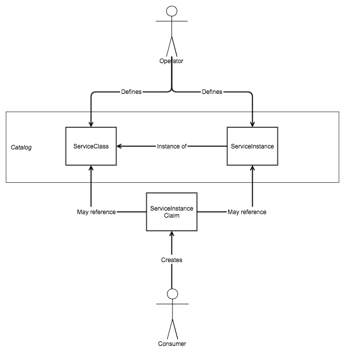

# Service Catalog API

This document proposes a Kubernetes-native service broker API. It is a formalization of [@krancour](http://github.com/krancour)'s [presentation](https://docs.google.com/presentation/d/1Fm3qG9zQ4R8ZbhtTObmQjO3UZYJ0ruYI4qr5w_gEKN8/edit?usp=sharing) that he gave at the sig-service-catalog meeting on 10/10/2016.

# Motivations

Two different demos were given at [10/3/2016’s sig-service-catalog meeting](https://www.youtube.com/watch?v=Kfar5Uw7CRg), both extremely promising. Each differed in quite a few ways, including how consumers used Kubernetes resources to communicate.

This proposal aims to define a standard API, including a schema for standard Kubernetes-native resources, to:

- Guide the continuing efforts shown in those demos
- Improve the user experience (both cluster operator and application developer)
- Attempt to extend the Kubernetes API instead of relying on comparatively clunky Third Party Resource types (long-term goal)
- Ensure a consistent user experience regardless of implementation, without undermining competition or choice

# Inspiration

Broadly speaking, we're proposing a system that can list services and allow consumers to provision, bind, unbind and deprovision them.

We'll draw inspiration from the [Persistent Volumes](http://kubernetes.io/docs/user-guide/persistent-volumes/) API and the [Ingress Controllers](http://kubernetes.io/docs/user-guide/ingress/) system. The remainder of this section explains these inspirations in further detail.

## Persistent Volumes

First, this problem space is symmetric to that of persistent volumes. We propose to model the data structures herein after those in persistent volumes primarily because we believe that consistency is a virtue. More importantly, the community benefits when similar problems have similar solutions.

Specifically, we believe that the following existing types provide a good model for a service catalog API:

- `StorageClass`
- `PersistentVolume`
- `PersistentVolumeClaim`

## Ingress Controllers

Today, operators choose their own implementation of an ingress controller. Kubernetes gives the operator the ability to specify any ingress controller, and the complete freedom to implement it themselves.

Similarly, permitting operators to implement or select their own service catalog controller would encourage freedom of choice and diversity. We propose a system similar to that defined in ingress controllers to do so.

# Proposed Resources

Given these inspirations, we propose adding the following resources to the Kubernetes API:

- `ServiceClass`
  - Describes a _kind_ of service (similar to how a `StorageClass` defines a _kind_ of persistent volume)
  - References a service ID and plan ID, which is managed and understood by a service controller (see below)
  - Created by an operator or tool
- `ServiceInstance`
  - An instance of a `ServiceClass` -- an in-cluster representation of a provisioned service
  - Can be statically provisioned by an operator, to enable multiple consumers to bind to it (enables multi-tenancy)
  - Can be dynamically provisioned and bound to by a consumer, to guarantee an app’s exclusive use of the resource (guarantees single-tenancy)
- `ServiceInstanceClaim`
  - Created by a consumer to bind to an existing ServiceInstance by name. As written above, this workflow enables multi-tenant usage of a resource
  - Created by a consumer to provision and bind to an existing ServiceClass. As written above, this workflow enables dedicated, single-tenant usage of a resource
- `ServiceInstanceBinding`
  - Created in response to a successful bind operation
  - References credentials created as a result of the bind operation
  - Holds a record of an application that’s bound to a service


The below diagram shows the expected interactions between these resources:



# Example Resources

## ServiceClass

```yaml
kind: ServiceClass
apiVersion: service-catalog.k8s.io/alpha
metadata:
  name: postgres-small
spec:
  serviceID: c5a0ad8e-b57b…
  planID: c68cd6b1-be9f…
```

## ServiceInstance

```yaml
kind: ServiceInstance
apiVersion: service-catalog.k8s.io/alpha
metadata:
  name: zip-code-db
spec:
  serviceClass: postgres-small
```

## ServiceInstanceClaim - Single Tenant

This example shows a `ServiceInstanceClaim` that directly references a `ServiceClass`. The controller that executes this claim will do a provision, then a bind.

```yaml
kind: ServiceInstanceClaim
apiVersion: service-catalog.k8s.io/alpha
metadata:
  name: my-app-db-claim
  namespace: my-app
status: unknown
spec:
  serviceClass: postgres-large
  targetBinding: my-app-binding
  status: unknown # only written by the service controller
  statusDescription: unknown # only written by the service controller
```

## ServiceInstanceBinding - Single Tenant

This example shows the output of a single-tenant `ServiceInstanceClaim`. It is the result of a controller executing a claim that directly references a `ServiceClass`.

```yaml
kind: ServiceInstanceBinding
apiVersion: service-catalog.k8s.io/alpha
metadata:
  name: my-app-binding # same as the previous 'targetBinding' field
  namespace: my-app
status:
  serviceClass: postgres-large
  secrets:
    - my-zip-code-creds-password
  configMaps:
    - my-zip-code-creds-username
    - my-zip-code-creds-conn-info
```

## ServiceInstanceClaim - Multi Tenant

This example shows a `ServiceInstanceClaim` that references a `ServiceInstance`. The controller that executes this claim will only do a bind.

```yaml
kind: ServiceInstanceClaim
apiVersion: service-catalog.k8s.io/alpha
metadata:
  name: my-zip-code-db-claim
  namespace: my-app
spec:
  serviceInstance: zip-code-db
  targetBinding: my-zip-code-binding
  status: unknown # only written by the service controller
  statusDescription: unknown # only written by the service controller
```

## ServiceInstanceBinding - Multi Tenant

This example shows the output of a multi-tenant `ServiceInstanceClaim`. It is the result of a controller executing a claim that just references a `ServiceInstance`.

```yaml
kind: ServiceInstanceBinding
apiVersion: service-catalog.k8s.io/alpha
metadata:
  name: my-zip-code-binding # same as the above 'targetBinding' field
  namespace: my-app
status:
  serviceInstance: zip-code-db
  secrets:
    - my-zip-code-creds-password
  configMaps:
    - my-zip-code-creds-username
    - my-zip-code-creds-conn-info
```

# The Service Catalog Controller

As indicated above, application developers and cluster operators interact with the aforementioned Kubernetes resources. The service catalog controller watches these resources and takes action on them.

Like ingress controllers, the operator is free to choose any service controller they prefer. All implementations, however, must satisfy the following requirements:

- Watch the event stream for new or deleted `ServiceInstance`s and `ServiceInstanceClaim`s
- On `ServiceInstance` creation, the controller must do a provision
- On `ServiceInstance` deletion, the controller must do a deprovision. The controller should not delete any existing `ServiceInstanceClaim`s or `ServiceInstanceBinding`s that reference the deleted `ServiceInstance`
- On `ServiceInstanceClaim` creation:
  - If the claim references an existing `ServiceInstance`, the controller must do a bind
  - If the claim references an existing `ServiceClass`, the controller must do a provision, then bind. The controller should not create a publicly-accessible `ServiceInstance`. This ensures that the provisioned/bound resource will be single-tenant and dedicated
- On `ServiceInstanceClaim` deletion:
  - If the claim referenced an existing `ServiceInstance`, the controller must do an unbind
  - If the claim referenced an existing `ServiceClass`, the controller must do an unbind, then a deprovision
- Any successful provision operation must change the `status` field of the applicable `ServiceInstanceClaim` to `provisioned`
- Any successful bind operation must:
  - Change the `ServiceInstanceClaim`'s `status` field to `bound`
  - Create the appropriate resources (`Secret`s, `ConfigMap`s) to hold credential and other resource-specific bind information
  - Create a new `ServiceInstanceBinding`:
    - With the same name as the claim’s `targetBinding` field
    - In the same namespace as the claim itself
    - With fields that point to all the previously created resources
- Any successful unbind operation must:
  - Change the claim’s `status` field to `unbound`
  - Delete the `ServiceInstanceBinding` that was created in the bind operation
  - Delete all resources that the aforementioned `ServiceInstanceBinding` points to
- Any failed operation must change the status field of the `ServiceInstanceClaim` to `failed`, and should write the reason of the failure into the `statusDescription` field

The below diagram shows all of the interactions that all service catalog controllers are expected to have.


# Visibility

The visibility of each resource and system described above is important to the functionality and ease-of-use in this system.

As usual, we propose following most of what both the persistent volumes and ingress systems specify.

- `ServiceClasse`s are cluster-global (just as `StorageClass`es are)
- `ServiceInstance`s are cluster-global (just as `PersistentVolume`s are)
- `ServiceInstanceClaim`s are namespace-scoped (just as `PersistentVolumeClaim`s are)
- `ServiceInstanceBinding`s are namespace-scoped
- Service catalog controllers may run on any number of namespaces, including cluster-global

# Security

We expect that many cluster operators will need to restrict usage of many provisionable and bindable resources. We propose building in the following mechanisms to do so:

## `ProvisioningPolicy`

Since `ServiceClass`es are cluster-global, operators must be able to restrict the namespaces that can provision and bind to each `ServiceClass`. A `ProvisioningPolicy` is a cluster-global resource that holds a blacklist that contains the namespaces that cannot provision and bind to each `ServiceClass`. A few additional notes:

- This resource is optional. If it doesn’t exist, there will be no blacklist applied
- In the future, we may add a whitelist or other more advanced filtering features

## BindingPolicy

Since `ServiceInstance`s are cluster-global, operators must be able to restrict the namespaces that can bind to each `ServiceInstance`. A `BindingPolicy` is a cluster-global resource that holds a blacklist that contains the namespaces that cannot bind to each `ServiceInstance`. A few additional notes:

- This resource is optional. If it doesn’t exist, there will be no blacklist applied
- In the future, we may add a whitelist or other advanced filtering features

## Quotas

We propose restricting provision and bind operations by namespace using standard quotas. This section is in need of additional detail.

## Final Note

Service catalog controllers will be responsible for enforcing both the policies and the quotas.
